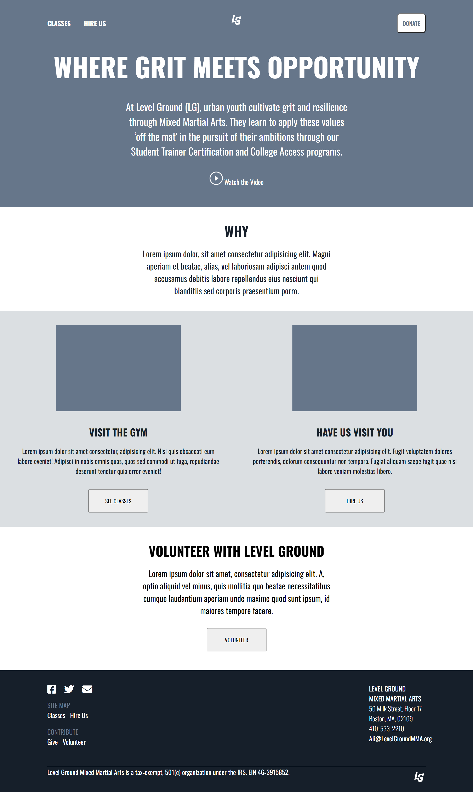

# Level Ground Website

### Description
A fully responsive mock-up of the Level Ground homepage. Level Ground is a Mixed Martial Arts Club.

### Tech Used
- HTML
- CSS

### Lessons Learned
- Use of CSS media queries

### Notes
Although the use of floats for layouts is outdated and less efficient than modern alternatives like flexbox and grid, I believe that it's still important to learn, in case you encounter situations where you need to work with legacy CSS or support older versions of IE.